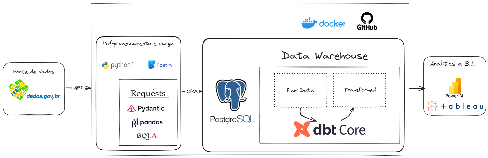

# Projeto de Análise de Despesas dos Deputados

## Objetivos do Projeto

O projeto tem como objetivo realizar a extração, carga e transformações de dados abertos disponíveis no portal da camara: [portal da camara dos deputados][def] e aplicar a normalização de dados e deixar o mais próximo possível do star schema proposto por Kimball porém utilizando ferramentas e tecnologias modernas explorando principalmente o dbt-core para fazer as transformações de dados seguindo um esquema de ELT (extração carga e transformações)

1. **Coletar Dados**: Consumir dados da API pública da Câmara dos Deputados sobre despesas parlamentares.
2. **Ingestão e Armazenamento Inicial**: Inserir os dados brutos na camada landing_zone no formato JSON"
3. **Armazenamento em Banco de Dados**: Carregar os dados para um banco de dados PostgreSQL na camada.
4. **Transformações**: Realizar várias transformações nos dados usando DBT (Data Build Tool) até atingir a camada `ouro`.
5. **Visualização**: Desenvolver um dashboard que apresente os gastos por partido e por deputado, além de características como idade, sexo e escolaridade dos deputados.


## Matriz de Dimensão Indicador

### Ao final do projeto, o objetivo é responder as seguintes perguntas em um dashboard iterativo de forma clara:

| Dimensão            | Indicadores                                                                           |
|---------------------|---------------------------------------------------------------------------------------|
| Deputado            | Total de gastos por deputado                                                          |
|                     | Média de gastos por deputado                                                          |
|                     | Total de despesas por tipo                 |
|                     | Sexo dos deputados (distribuição por gênero)                                           |
| Partido             | Total de gastos por partido                                                            |
|                     | Média de gastos por deputado no partido                                                |
|                     | Número total de despesas por partido                                                   |
|                     | Número de deputados por partido                                                        |
|                     | Média de idade dos deputados no partido                                                |
|                     | Distribuição por genero dos deputados                                                 |
|                     | Distribuição educacional dos deputados no partido (formação acadêmica)                |
| Estado              | Total de gastos por estado                                                             |
|                     | Média de gastos por deputado no estado                                                 |
|                     | Número total de despesas por estado                                                    |
| Formação dos Deputados | Distribuição educacional dos deputados  |


Esta matriz define os principais indicadores que serão desenvolvidos e visualizados no projeto, fornecendo uma estrutura clara das análises que serão realizadas.


## Arquitetura do Projeto

A imagem abaixo descreve a arquitetura escolhida para o projeto:




## Tecnologias Utilizadas

- **Python**: Versão 3.12.2
- **Poetry**: Para gerenciamento de dependências
- **Pydantic**: Para validações de dados
- **DBT (Data Build Tool)**: Para transformações de dados
- **PostgreSQL**: Para armazenamento dos dados na camada `bronze`
- **MkDocs**: Para documentação

## Estrutura do Projeto

```plaintext
.
DADOS-ABERTOS-CAMARA
├── .venv
├── app
│   ├── data_ingestion.py
│   └── get_api_data.py
├── data
│   └── .env
├── .gitignore
├── .python-version
├── poetry.lock
├── pyproject.toml
└── README.md
```

## Configuração do Ambiente

1. **Clone o repositório**:
    ```bash
    git clone https://github.com/seu_usuario/seu_projeto.git
    cd seu_projeto
    ```

2. **Instale as dependências com Poetry**:
    ```bash
    poetry install
    ```

3. **Configure o banco de dados PostgreSQL**:
    - Crie um banco de dados PostgreSQL e configure as credenciais no arquivo `.env`.

4. **Execute as ingestões e transformações**:
    - Execute o script de ingestão de dados:
        ```bash
        poetry run python src/data_ingestion.py
        ```
    - Execute as transformações com DBT:
        ```bash
        cd dbt_project
        dbt run
        ```

## Utilização

- **Ingestão de Dados**: O script `data_ingestion.py` consome dados da API e salva na camada `landing_zone`.
- **Transformações**: As transformações são realizadas usando DBT, gerando as camadas `silver` e `gold`.
- **Visualização**: Os dados transformados são utilizados para gerar visualizações em um dashboard.


/home/devenv/.dbt/profiles.yml

[def]: https://dadosabertos.camara.leg.br/swagger/api.html


