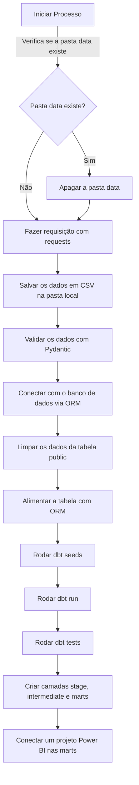

# **4.0 Fluxo das Etapas**

#### 4.1 Abaixo o fluxo macro que descreve o fluxo da pipeline

  - **4.1.1 Inicia o processo:**
    Começa por verificar se já existe uma pasta chamada "data" onde vamos armazenar nosso dado.

- **4.1.2 Verifica a existência da pasta "data":**
  - **Se a pasta existe:**
    Vamos apagar tudo que está dentro dela para começar com uma base limpa.
  - **Se a pasta não existe:**
    Avança para o próximo passo sem alterar nada.

- **4.1.3 Obtém os dados:**
  Usa a biblioteca `requests` para fazer uma requisição e buscar novo dado externo que precisamos.

- **4.1.4 Armazena os dados em CSV:**
  Depois de obter os dados, os salva localmente em um arquivo CSV para facilitar o gerenciamento e manipulação.

- **4.1.5 Valida os dados:**
  Utiliza o Pydantic para garantir que o dado que coletamos esteja correto e no formato esperado.

- **4.1.6 Conecta com o banco de dados:**
  Estabelece uma conexão segura com nosso banco de dados usando um ORM, que ajuda a simplificar a interação com o banco.

- **4.1.7 Atualiza a tabela no banco de dados:**
  Limpa os dado antigo da tabela no banco de dados e insere o novo dado que acabamos de coletar e validar.

- **4.1.8 Monitora e registra evento:**
  Para acompanhar o progresso e lidar com qualquer problema, usa o Loguru para gerenciar registro detalhado de evento e possível falha durante o processo.

- **4.1.9 Prepara o dado com dbt:**
  Utiliza o dbt para executar série de operação, como carregar dado inicial (seed), transformar dado conforme necessário e realizar teste para garantir qualidade do dado.

- **4.1.10 Organiza o dado em camada:**
  No dbt, organiza o dado em camada estruturada como stage (estágio), intermediate (intermediária) e mart (mart), o que facilita gestão e análise futura do dado.

- **4.1.11 Integra com o Power BI:**
  Finalmente, integra o dado preparado e estruturado no dbt com um projeto do Power BI, onde pode criar visualização e análise poderosa para nosso usuário final.
